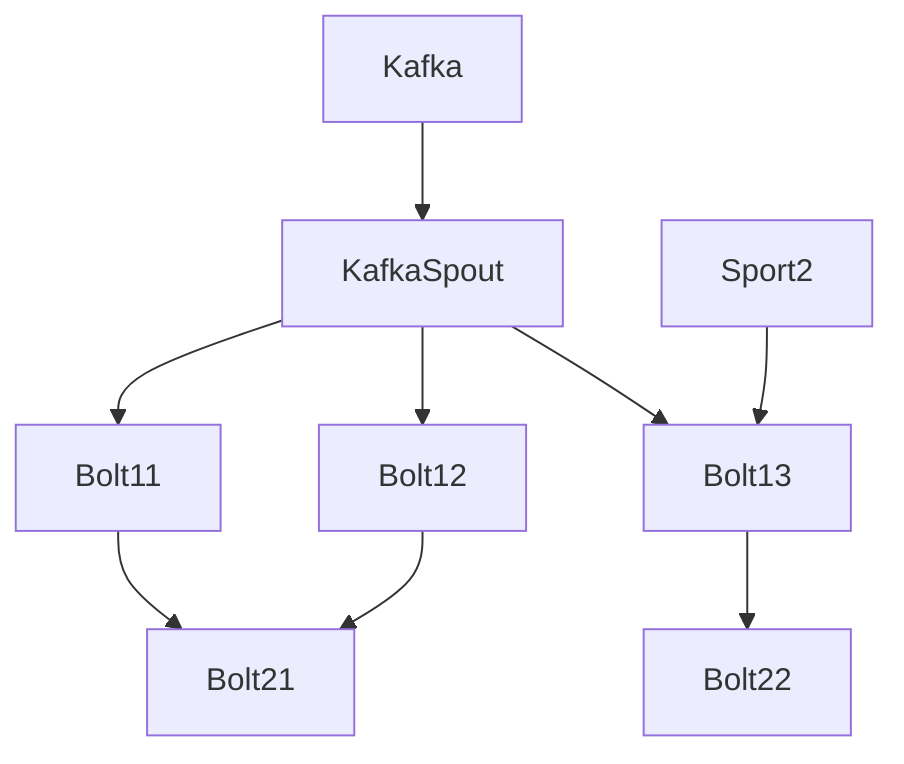

题目
====

# 一级标题
## 二级标题


******

* 列表1
    + 列表1.1
        - 列表 1.1.
    + 列表1.2
* [列表2](http://www,baidu.com)
* [列表3](#2.2)

s


在`NIO`中，所有的数据都是用缓冲区处理的，读取数据时，它是从**通道**(`Channel`)直接读到缓冲区中，~~网络~~数据通过***Channel***读取和写入。


```bash
ps -ef | grep java
```

```sql
SELECT * FROM user;
```

tChannel和SocketChannel就是其子类)、用于文件操作的FileChannel。下面的例子给出通过FileChannel来向文件中写入数据、从文件中读取数据  
将文件数据拷贝到另一个文件中：

<br><br><br>

另一个文件中：

> 昨夜西风凋碧树 高楼望尽天涯路


章节 | 进度 | 时间
---- | --- | ----
1-1 监控的介绍[免费试看]    | 0%    | 42:13   
1-2 [Prometheus组件的介绍](http://b.edu.51cto.com/wanda/course/course-detail?courseId=15867)    | 0%    | 19:38
1-3 Prometheus              | 0%    | 13:11

开始学

s

1  



******

2  
2  
3  
3  
2
1  
s  
d  
e  
e  
w  
1  
2  
2  
3  
3  
2  
1  
s  
d  
e  
e  
w  
<a id='2.2'></a>ending
s


